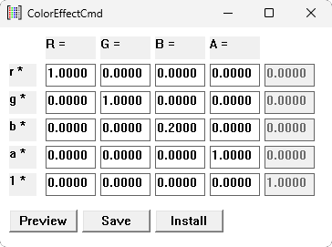

# ColorEffectCmd
The Windows [Magnification API](https://learn.microsoft.com/en-us/previous-versions/windows/desktop/magapi/magapi-intro#getting-started) can be used to apply a [5x5 matrix color transformation](https://learn.microsoft.com/en-us/windows/win32/gdiplus/-gdiplus-using-a-color-matrix-to-transform-a-single-color-use) to the entire screen using the [MagSetFullscreenColorEffect](https://learn.microsoft.com/en-us/windows/win32/api/magnification/nf-magnification-magsetfullscreencoloreffect) function. Basically this allows you to apply color shifting effects to the screen. This program is a really basic tool that lets you set your own 5x5 matrix.



## Matrix Multiplication
What is a 5x5 matrix color transformation? Assume out input color values are `r`, `g`, `b`, and `a` (for red, blue, green, and alpha). Each one is on a scale of 0 to 1 (you might be expecting a scale of 0 to 255, but no). For reasons that will make sense later, it's nice to have a constant `1` that is also part of your input matrix, so the input matrix will look like this:
```
[  r  g  b  a  1  ]
```
Our output matrix looks very similar. Lets call our output values `R`, `G`, `B`, and `A`. For reasons I don't totally understand, there is also a dummy output value. We will call that value `D`. Our output matrix will look like this
```
[  R  G  B  A  D  ]
```
We get to pick a 5x5 matrix that will transform our input data and give us our output data. Each column in the matrix corresponds to an output color in our output matrix. Each row represents corresponds to an input channel from our input matrix. For example, if the first column of our 5x5 matrix looked like this:
```
0.1
0.2
0.3
0.4
0.5
```
Then the output value for the red channel would be
```
R = (0.1*r) + (0.2*g) + (0.3*b) + (0.4*a) + (0.5)
```
## Example Matrices
The most basic matrix looks like this:
```
1 0 0 0 0
0 1 0 0 0
0 0 1 0 0
0 0 0 1 0
0 0 0 0 1
```
It's kind of pointless. It sets each output channel equal to it's input channel.

Here is an example that turns off the blue and green channels entirely
```
1 0 0 0 0
0 0 0 0 0
0 0 0 0 0
0 0 0 1 0
0 0 0 0 0
```
Note that we left the alpha channel unchanged. You very rarely want to change the alpha channel, so your 4th column will almost always be
```
0
0
0
1
0
```
Lastly, lets do an example using that 5th input channel that just sets the entire screen yellow:
```
0.0 0.0 0.0 0.0 0.0
0.0 0.0 0.0 0.0 0.0
0.0 0.0 0.0 0.0 0.0
0.0 0.0 0.0 1.0 0.0
0.5 0.5 0.0 0.0 0.0
```
This is a good example of why, when testing, it is recommended to use the "Preview" button. The preview button will apply the effect for 3 seconds then revert so you can make sure your display is still somewhat useable.

## Installing
The application includes a "Save" and "Install" button. The save button saves your current matrix to "AppData\Local\ColorEffectCmd\matrix.txt". The install button copies the EXE from it's current location to "AppData\Local\ColorEffectCmd\ColorEffectCmd.exe" and sets it to run at login with the `/h` flag (to hide the window).

"Uninstall" just removes that launch-at-login entry

## Compiling
This API docs say it doesn't work under [WoW64](https://en.wikipedia.org/wiki/WoW64), so you **must** use a 64-bit binary on a 64-bit computer. My testing disagrees with this (32-bit seems to work everywhere). YMMM. There is a build.bat that can be run under the Visual Studio Developer Tools Command Prompt. See the releases page for a pre-compiled binary.
